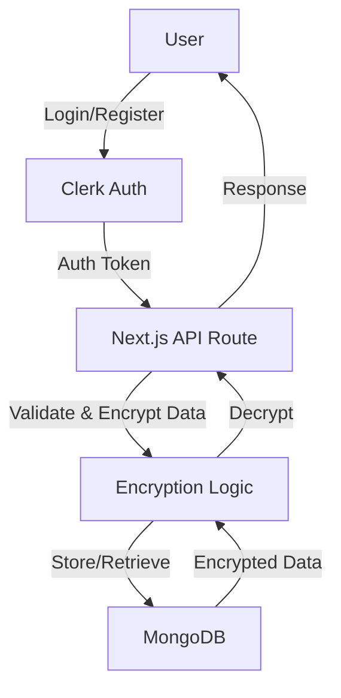

# Secure Vault 🔐

> A modern, full-stack password and card manager built with Next.js, MongoDB, and Clerk authentication. Securely store, manage, and retrieve your sensitive information with robust encryption and a beautiful UI.

## Features

- **User Authentication:** Seamless sign-in/sign-up with Clerk.
- **Password & Card Management:** Add, view, and delete passwords and card details.
- **End-to-End Encryption:** Sensitive data is encrypted before storage in MongoDB.
- **Rate Limiting:** API endpoints are protected against abuse.
- **Responsive UI:** Built with Tailwind CSS and modern React components.
- **Optimized Fonts:** Uses Vercel's Geist font for a clean look.

---

## Data Flow Diagram



---

## Getting Started

1. **Clone the repository:**

   ```bash
   git clone https://github.com/your-username/secure-vault.git
   cd secure-vault
   ```

2. **Install dependencies:**

   ```bash
   npm install
   # or
   yarn
   # or
   pnpm install
   # or
   bun install
   ```

3. **Set up environment variables:**

   - Copy `.env.example` to `.env.local` and fill in your MongoDB URI, Clerk keys, and encryption secret.

4. **Run the development server:**

   ```bash
   npm run dev
   # or yarn dev / pnpm dev / bun dev
   ```

5. **Open the app:**
   Visit [http://localhost:3000](http://localhost:3000) in your browser.

---

## Folder Structure

- `app/` - Next.js app directory (routes, layouts, API endpoints)
- `components/` - Reusable UI and logic components
- `db/` - MongoDB connection logic
- `models/` - Mongoose models with encryption logic
- `lib/` - Utility functions
- `types/` - TypeScript type definitions
- `public/` - Static assets (icons, images)

---

## Security

- All sensitive data is encrypted before being stored in the database.
- API endpoints are protected with rate limiting.
- User authentication is handled by Clerk.

---

## Deployment

Deploy easily on [Vercel](https://vercel.com/) or your preferred platform. See [Next.js deployment docs](https://nextjs.org/docs/app/building-your-application/deploying).

---

## License

MIT
