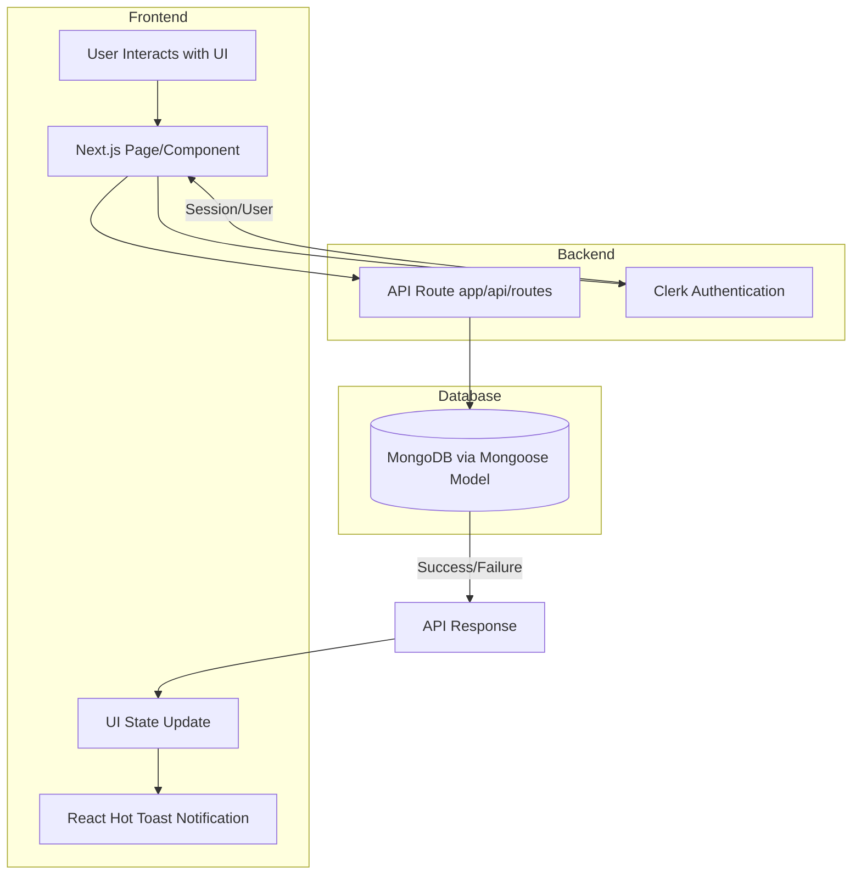

# Password Manager

A secure, modern password manager built with [Next.js](https://nextjs.org), [MongoDB](https://www.mongodb.com/), and [Mongoose](https://mongoosejs.com/). This project leverages authentication via [Clerk](https://clerk.com/), a clean UI with [Radix UI](https://www.radix-ui.com/), and robust state management for storing and retrieving sensitive data.

---

## 🚀 Getting Started

### 1. Clone the Repository

```bash
git clone https://github.com/your-username/password-manager.git
cd password-manager
```

### 2. Install Dependencies

```bash
npm install
# or
yarn install
# or
pnpm install
```

### 3. Set Up Environment Variables

Create a `.env.local` file in the root directory and add your MongoDB connection string and Clerk credentials:

```env
DATABASE_URL=mongodb+srv://<username>:<password>@cluster.mongodb.net/password-manager?retryWrites=true&w=majority
CLERK_PUBLISHABLE_KEY=your_clerk_publishable_key
CLERK_SECRET_KEY=your_clerk_secret_key
```

### 4. Run the Development Server

```bash
npm run dev
# or
yarn dev
# or
pnpm dev
# or
bun dev
```

Open [http://localhost:3000](http://localhost:3000) to view the app.

---

## 🗂️ Project Structure

```
password-manager/
├── app/                # Next.js app directory (routes, pages, API)
│   └── api/            # API routes (REST endpoints)
├── models/             # Mongoose schemas (password, card, user)
├── utils/              # Utility functions (e.g., MongoDB connection)
├── public/             # Static assets
├── styles/             # Tailwind and global styles
├── package.json
└── README.md
```

---

## 🛠️ Main Dependencies

- **Next.js**: React framework for SSR, routing, and API routes.
- **MongoDB & Mongoose**: Database and ODM for schema validation and data modeling.
- **Clerk**: Authentication and user management.
- **Shadcn UI**: Accessible UI primitives.
- **Tailwind CSS**: Utility-first CSS framework.
- **React Hot Toast**: Notifications.
- **Lucide React**: Icon library.

---

## 🧩 Data Flow & Architecture

Below is a high-level overview of the data flow in the application, from user interaction to database operations and UI updates.


```mermaid
flowchart TD
    A[User Interacts with UI] --> B[Next.js Page/Component]
    B --> C[API Route app/api/routes]
    C --> D[(MongoDB via Mongoose Model)]
    D -- Success/Failure --> E[API Response]
    E --> F[UI State Update]
    F --> G[React Hot Toast Notification]
    B --> H[Clerk Authentication]
    H -- Session/User --> B

    subgraph Database
        D
    end
    subgraph Frontend
        A
        B
        F
        G
    end
    subgraph Backend
        C
        H
    end
```

### **Detailed Flow**

1. **User Action**: User logs in, adds, views, or deletes a password/card.
2. **Authentication**: Clerk ensures the user is authenticated.
3. **API Request**: Next.js API route receives the request (e.g., `/api/password/new`).
4. **Database Operation**: API handler uses a Mongoose model (e.g., `passwordModel`) to interact with MongoDB.
5. **Response**: API returns data or error.
6. **UI Update**: React state updates, and feedback is shown via React Hot Toast.

---

## 📦 Schemas

### Password Schema (`models/password.js`)

```js
website:   String (required)
username:  String (required)
password:  String (required)
createdBy: String (required, user id)
timestamps: true
```

### Card Schema (`models/card.js`)

```js
cardNumber: Number (required)
expiryDate: String (required)
cvv:        Number (required)
createdBy:  String (required, user id)
timestamps: true
```

### User Schema (`models/user.js`)

```js
name:  String (required, default: "Guest")
email: String (required, unique)
timestamps: true
```

---

## 🔒 Security

- **Authentication**: All sensitive routes are protected using Clerk.
- **Validation**: All models enforce required fields and types.
- **Environment Variables**: Secrets and DB credentials are never hardcoded.

---

## 📚 Learn More

- [Next.js Documentation](https://nextjs.org/docs)
- [MongoDB Docs](https://www.mongodb.com/docs/)
- [Clerk Docs](https://clerk.com/docs)
- [Radix UI Docs](https://www.radix-ui.com/docs)
- [Tailwind CSS Docs](https://tailwindcss.com/docs)

---

## 🚀 Deploy

Deploy easily on [Vercel](https://vercel.com/new?utm_medium=default-template&filter=next.js&utm_source=create-next-app&utm_campaign=create-next-app-readme).

See [Next.js deployment documentation](https://nextjs.org/docs/app/building-your-application/deploying) for more details.

---

## 🤝 Contributing

Pull requests and issues are welcome! Please open an issue to discuss your ideas or report bugs.

---

**MIT License**

---
